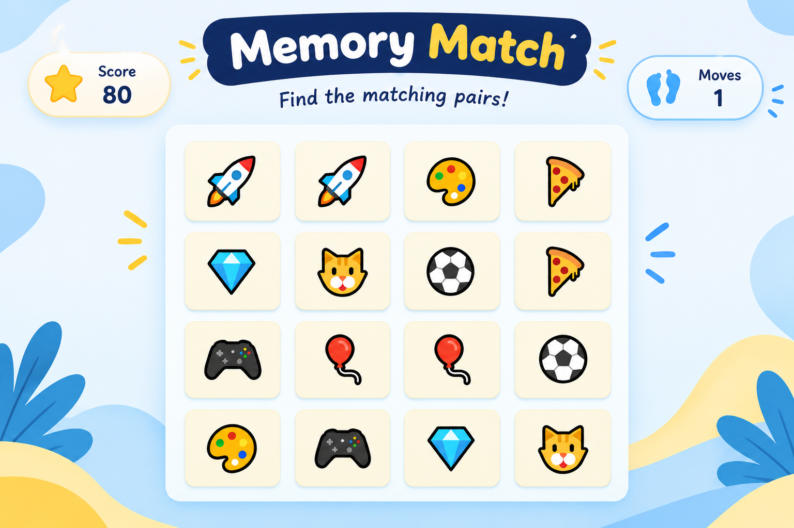

# 🧠 Memory Match Game

A simple and fun Memory Match Game built using **HTML, CSS, and JavaScript**.

## 🎮 Features

* 8 matching pairs
* Score tracking
* Moves counter
* Interactive card flipping
* Responsive design
* Simple and colorful interface

## 🛠️ Technologies Used

* HTML
* CSS
* JavaScript

## 🚀 How to Play

1. Click on a card to reveal it.
2. Click another card to find its matching pair.
3. Match all 8 pairs.
4. Try to complete the game in as few moves as possible!

## 👩‍💻 Project

This project was created as a beginner web development project to practice HTML, CSS, and JavaScript.

